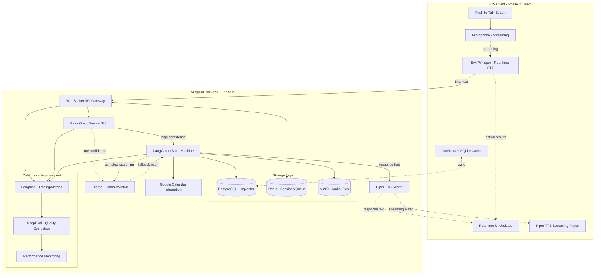

# Requirements Document (AI Agent Direct Phase 2)

## Introduction

MERE(Memory Engagement & Reminder Expert)는 **고도화된 AI Agent 기반 음성 비서 멀티 플랫폼 애플리케이션**입니다.  
이 Agent는 사용자의 음성을 인식(STT)하고, **Rasa NLU를 통해 정교한 Intent 해석**을 하며, **LangGraph 상태 머신으로 복합 업무**를 처리하고, 메모/할일/일정을 관리하며, 피드백을 음성과 화면으로 제공합니다.

Phase 1을 건너뛰고 **Phase 2 고도화 기능을 직접 구현**하여 iOS 우선 개발로 **완전한 AI Agent 시연**을 목표로 하며, Phase 3에서 안드로이드 및 웹 플랫폼으로 확장합니다.  
사용자는 "기억해", "일정 잡아줘", "지난주에 뭐 적었더라?" 같은 자연스러운 음성 명령을 통해 **고도화된 AI Agent와 대화**하듯 메모 저장·검색과 Google Calendar 연동 일정 관리를 할 수 있습니다.

## Recommended Open Source SDK Stack (Phase 2 Direct)

**Phase 2 고도화 AI Agent를 직접 구현하기 위한 완전 오픈소스 스택:**

### Core AI Agent Components
- **STT (Speech-to-Text):** [SwiftWhisper](https://github.com/argmaxinc/WhisperKit) – whisper.cpp wrapper, 실시간 스트리밍 STT, 완전 오프라인
- **TTS (Text-to-Speech):** [Piper TTS](https://github.com/rhasspy/piper) – 경량 서버로 스트리밍 TTS, 한국어 음성 모델 지원
- **NLU (Natural Language Understanding):** [Rasa Open Source](https://rasa.com/docs/rasa/) – 정교한 Intent & Entity 파싱, 슬롯 충전, 대화 관리
- **Korean Time Expression Parsing:** [SwiftyChrono](https://github.com/nerdyc/SwiftyChrono) + 서버 폴백 [dateparser](https://github.com/scrapinghub/dateparser)
- **Agent Orchestration:** [LangGraph](https://www.langchain.com/langgraph) – 상태 기계/그래프 기반 복합 업무 처리, 재시도, 체크포인트
- **LLM Runtime:** [Ollama](https://github.com/ollama/ollama) – Llama3/Mistral 로컬 실행, 폴백 Intent 해석 및 요약

### Backend & Infrastructure
- **API Server:** FastAPI (비동기 처리, WebSocket 지원)
- **Database:** PostgreSQL + pgvector (벡터 검색 준비)
- **Cache & Queue:** Redis (세션 관리, 비동기 작업 큐)
- **Storage:** MinIO (오디오 파일, 첨부 저장)

### Observability & Continuous Improvement
- **Tracing & Metrics:** [Langfuse](https://langfuse.com/) – 셀프 호스팅 트레이싱, 성능 측정, 실패 분석
- **Evaluation & Testing:** [DeepEval](https://github.com/confident-ai/deepeval) + [promptfoo](https://promptfoo.dev/) – 회귀 테스트, A/B 테스트

이 스택의 핵심 특징:
- **완전 오픈소스** – 벤더 락인 없음
- **P50 < 2s 응답 시작** – 실시간 스트리밍으로 체감 지연 최소화
- **지속 개선 루프** – 관찰성과 평가 시스템으로 성능 향상
- **복합 업무 처리** – LangGraph로 확인/수정/롤백 등 복잡한 대화 흐름 지원

---

## Development Phases

- **Phase 2 (iOS 고도화 AI Agent):** PTT → 실시간 STT 스트리밍 → Rasa NLU Intent 해석 → LangGraph 상태 관리 → 메모/일정/검색 → 실시간 TTS 스트리밍 피드백 (2-3주 완전 구현)
- **Phase 3 (멀티 플랫폼 확장 AI Agent):** Android MVP, 웹 플랫폼, 의미 기반 검색, PII 필터링, 플랫폼별 네이티브 기능, 협업 기능

## Requirements

### Requirement 1: AI Agent 실시간 음성 입출력 시스템 [Phase 2 Direct]

**User Story:** 사용자로서, PTT 버튼으로 AI Agent에게 음성 명령을 내리고 **실시간 스트리밍으로 즉각적인 피드백**을 받고 싶다.

#### Acceptance Criteria

1. WHEN 사용자가 PTT 버튼을 누르고 말할 THEN SwiftWhisper가 **실시간으로 음성을 텍스트로 스트리밍 변환**해야 한다
2. WHEN PTT 버튼을 놓을 THEN 음성 입력이 종료되고 **Rasa NLU로 정교한 Intent 해석** 단계로 넘어가야 한다
3. WHEN 음성 인식이 완료될 THEN AI Agent는 **P50 <2초, P90 <2.5초 이내에 TTS 스트리밍 시작**해야 한다
4. WHEN 응답할 THEN AI Agent는 **Piper TTS로 문장별 실시간 스트리밍**으로 피드백하고 화면에도 표시해야 한다
5. WHEN STT 결과가 빈 값이거나 신뢰도가 낮을 THEN **Rasa fallback policy**가 작동하여 "다시 말씀해 주세요"라고 안내해야 한다
6. WHEN 복잡한 명령일 THEN **LangGraph가 상태를 관리**하며 확인 질문을 해야 한다

------------------------------------------------------------------------

### Requirement 2: AI Agent 고도화 메모/할일 관리 시스템 [Phase 2 Direct]

**User Story:** 사용자로서, 자연스러운 음성으로 AI Agent에게 복잡한 메모와 할 일 관리 명령을 내리고 **지능적인 응답**을 받고 싶다.

#### Acceptance Criteria

1. **정교한 Intent 인식**: "내일 아침에 우유 사는 거 기억시켜줘" → Rasa가 intent=remember, entity=item(우유), time(내일 아침), action=remind로 파싱
2. **슬롯 충전**: "회의 시간 바꿔줘" → "어떤 회의인가요?" 확인 후 슬롯 충전 완료까지 대화 관리  
3. **상태 관리**: "이전 할 일 수정해줘" → LangGraph가 컨텍스트를 유지하며 최근 todo 식별 후 수정
4. **복합 검색**: "지난주에 쇼핑과 관련해서 뭘 적었지?" → 의미 기반 키워드 매칭으로 관련 메모 검색
5. **확인 및 롤백**: "아니야, 취소해" → LangGraph가 이전 액션을 롤백하고 원래 상태 복구
6. **오프라인 동작**: 네트워크 없을 시 로컬 저장 후 **나중에 자동 동기화**

------------------------------------------------------------------------

### Requirement 3: AI Agent 지능형 일정 관리 시스템 [Phase 2 Direct]

**User Story:** 사용자로서, 복잡한 일정 요청을 음성으로 하고 AI Agent가 **지능적으로 처리**하기를 원한다.

#### Acceptance Criteria

1. **복잡한 시간 해석**: "다다음주 화요일 오후에 2시간 짜리 프레젠테이션 준비 시간 잡아줘" → 정확한 날짜/시간 계산 및 2시간 블록 생성
2. **충돌 감지**: 기존 일정과 겹칠 시 "그 시간에 다른 일정이 있는데, 다른 시간은 어떠세요?" 제안
3. **지능형 확인**: "중요한 회의인가요?" → 우선순위에 따라 알림 설정 차별화
4. **일정 수정**: "내일 회의 30분 늦춰줘" → 기존 일정 찾아서 수정 후 참석자에게 알림 (향후)
5. **반복 일정**: "매주 월요일 오전 10시 팀 미팅" → 반복 일정 생성 및 예외 처리
6. **오류 복구**: Google Calendar API 실패 시 **로컬 임시 저장 후 재시도** 메커니즘

------------------------------------------------------------------------

### Requirement 4: AI Agent 고급 한국어 NLU 시스템 [Phase 2 Direct]

**User Story:** 사용자로서, 복잡하고 모호한 한국어 표현을 AI Agent가 **정확히 이해**하기를 원한다.

#### Acceptance Criteria

- **Rasa NLU Pipeline**: konlpy tokenizer + custom word embeddings + DIETClassifier
- **Entity Recognition**: 시간(SwiftyChrono + custom), 사람명, 장소, 할일 카테고리 등
- **Intent Confidence**: 0.8 이상 시 즉시 실행, 0.5-0.8 시 확인 질문, 0.5 미만 시 재질문
- **컨텍스트 유지**: "그 회의 말고 다른 거" → 이전 대화 맥락에서 "그 회의" 해석
- **모호성 해결**: "내일 회의" → "오전/오후 중 언제인가요?" 
- **폴백 처리**: Rasa 실패 시 **Ollama LLM으로 의도 추론** 1회 시도

------------------------------------------------------------------------

### Requirement 5: AI Agent LangGraph 상태 관리 시스템 [Phase 2 Direct]

**User Story:** 사용자로서, AI Agent가 복잡한 업무를 **단계별로 처리**하고 중간에 수정이나 취소도 가능하기를 원한다.

#### Acceptance Criteria

1. **상태 머신**: 메모 저장 → 확인 → 저장 완료 / 일정 생성 → 충돌 확인 → 확인 질문 → 최종 저장
2. **체크포인트**: 각 단계별 상태 저장으로 오류 시 이전 단계로 복구
3. **인터럽션 처리**: "아니야, 취소해" / "시간 바꿔줘" 등 중간 수정 요청 처리
4. **재시도 로직**: API 호출 실패 시 지수 백오프로 3회 재시도
5. **동시성 관리**: 여러 요청이 들어와도 사용자별 상태 격리
6. **상태 시각화**: 디버깅용 상태 그래프 로깅

------------------------------------------------------------------------

### Requirement 6: AI Agent 관찰성 및 지속 개선 [Phase 2 Direct]

**User Story:** 개발팀으로서, AI Agent의 성능을 **실시간으로 모니터링**하고 **지속적으로 개선**하고 싶다.

#### Acceptance Criteria

1. **Langfuse 트레이싱**: 전체 요청 플로우의 각 단계별 지연시간, 성공/실패율 추적
2. **성능 메트릭**: STT→NLU→LangGraph→API→TTS 각 단계별 P50/P90/P99 지연시간
3. **실패 분석**: Intent 인식 실패, API 호출 실패, TTS 오류 등 자동 분류 및 알림
4. **A/B 테스트**: NLU 모델 버전별, TTS 음성별 사용자 만족도 비교
5. **지속 개선**: 실패 케이스 자동 수집 → Rasa 트레이닝 데이터 보강 → 재배포
6. **비용 추적**: Ollama 토큰 사용량, API 호출 비용 (무료 서비스이지만 리소스 사용량)

------------------------------------------------------------------------

### Requirement 7: AI Agent 다중 접근 방식 [Phase 2-3]

- **Phase 2**: iOS 앱 PTT, 백그라운드 실행, 푸시 알림 미리보기
- **Phase 3**: Siri Shortcuts, Android Assistant, 웹 인터페이스

------------------------------------------------------------------------

### Requirement 8: AI Agent 보안 및 프라이버시 [Phase 2 Direct]

- **온디바이스 우선**: STT/TTS는 가능한 로컬 처리, 민감한 음성 데이터 서버 전송 최소화
- **데이터 암호화**: 전송 구간 TLS 1.3, 저장 구간 AES-256
- **데이터 보존**: 음성 파일 30일 후 자동 삭제, 트레이싱 로그 90일 보존
- **권한 관리**: 마이크/캘린더 접근 권한 최소화, 사용자 동의 기반

------------------------------------------------------------------------

### Requirement 9: AI Agent 성능 및 측정 [Phase 2 Direct]

- **실시간 성능**: 전체 플로우 P50 <2s, P90 <2.5s
- **스트리밍 지연**: TTS 첫 음성 출력까지 P50 <500ms
- **정확도**: Intent 인식률 95% 이상, Entity 추출 정확도 90% 이상
- **가용성**: 99.9% 업타임 (로컬 처리로 네트워크 장애 영향 최소화)

------------------------------------------------------------------------

### Requirement 10: AI Agent 멀티 플랫폼 [Phase 3]

- **Android**: Vosk STT + Piper TTS, 동일한 백엔드 연동
- **Web**: WebRTC 음성 입력 + WebAudio TTS, PWA 지원

------------------------------------------------------------------------

### Requirement 11: AI Agent 수용 테스트 시나리오 [Phase 2 Direct]

**15개 고도화 시나리오로 Phase 2 AI Agent 검증:**

#### 메모/할일 관리 (7개)
1. "내일 아침 일찍 우유 사는 거 기억시켜줘" → 시간 파싱, 알림 설정
2. "방금 말한 할일 취소해" → LangGraph 롤백 처리
3. "이번 주에 쇼핑 관련해서 뭘 적었더라?" → 의미 기반 검색
4. "할일 목록에서 긴급한 것부터 보여줘" → 우선순위 정렬
5. "프로젝트 관련 메모들 다 들려줘" → 카테고리 필터링
6. "지난주 화요일에 뭘 했는지 확인해줘" → 날짜 범위 검색
7. "할일 완료 표시하고 다음 할일로 넘어가줘" → 상태 변경 + 자동 진행

#### 일정 관리 (5개)
8. "다다음주 수요일 오후 2시간 짜리 프레젠테이션 준비 시간 잡아줘" → 복잡한 시간 해석
9. "내일 오전 회의 30분 늦춰줘" → 기존 일정 수정
10. "이번 주 일정 중에 변경 가능한 것들 보여줘" → 일정 우선순위 분석
11. "매주 월요일 오전 10시 팀 미팅 잡아줘" → 반복 일정
12. "오늘 일정이 너무 빡빡한데 뭔가 다른 날로 옮길 수 있어?" → 일정 최적화 제안

#### 상호작용 및 오류 처리 (3개)
13. "아까 말한 그 회의 말고..." (중간에 말 끊기) → 컨텍스트 유지 + 인터럽션 처리
14. [네트워크 끊어진 상태] "내일 병원 가는 거 기억해줘" → 오프라인 저장 + 동기화
15. [큰 소음 환경] PTT 버튼 + 명령 → STT 신뢰도 기반 재질문

---

## System Architecture (Phase 2 Direct Implementation)

> 목표: **P50 < 2s / P90 < 2.5s 실시간 스트리밍 응답**, **Rasa + LangGraph 기반 지능형 대화**, **Langfuse 기반 지속 개선**

### High-level Architecture (Mermaid)

### Phase 2 Direct Implementation Details

#### Client (iOS - Real-time & Streaming)
- **SwiftWhisper**: 실시간 스트리밍 STT, 부분 결과를 UI에 즉시 반영
- **WebSocket**: 서버와 실시간 양방향 통신, 연결 상태 관리
- **Piper Audio Player**: 스트리밍 TTS 오디오 재생, 버퍼링 최소화
- **Local Cache**: CoreData + SQLite, 오프라인 동작 및 빠른 응답
- **Real-time UI**: 음성 인식 진행률, 상태 머신 단계, 스트리밍 텍스트

#### AI Agent Backend (Production-Ready)
- **WebSocket API**: FastAPI + WebSocket, 실시간 양방향 통신
- **Rasa NLU**: 
  - konlpy + custom Korean tokenizer
  - DIETClassifier + TEDPolicy
  - Custom actions for business logic
  - Confidence threshold 기반 폴백
- **LangGraph Orchestrator**:
  - State machine: input→parse→confirm→execute→respond
  - Checkpoint system for rollback/retry
  - Parallel execution for complex workflows
  - Error handling with exponential backoff
- **Ollama Integration**:
  - Local Llama3-8B for fallback intent parsing
  - Mistral-7B for text summarization
  - No external API costs
- **Piper TTS Server**:
  - Korean voice model (jenny/thorsten)
  - Streaming output with chunked transfer
  - Audio quality optimization

#### Storage & Performance (Scalable)
- **PostgreSQL**: 
  - Structured data (users, memos, todos, events)
  - pgvector extension for semantic search
  - Connection pooling + read replicas
- **Redis**:
  - Session management (user contexts)
  - Async task queue (Celery integration)
  - Rate limiting and caching
- **MinIO**:
  - Audio file storage (for debugging/training)
  - Backup and disaster recovery

#### Observability & Continuous Improvement (Production-Grade)
- **Langfuse Self-hosted**:
  - End-to-end tracing (STT→NLU→Graph→TTS)
  - Performance metrics (latency, throughput, error rates)
  - Cost tracking (compute usage, storage)
  - User feedback collection
- **DeepEval + promptfoo**:
  - Automated quality evaluation
  - A/B testing framework  
  - Regression testing on golden datasets
  - Performance benchmarking

### Performance Optimization Strategy

#### Latency Reduction (Target: P50 <2s)
1. **Streaming STT**: 부분 결과를 실시간으로 처리 시작 (~200ms 단축)
2. **Parallel Processing**: NLU와 entity parsing 동시 실행 (~100ms 단축)  
3. **Response Caching**: 자주 묻는 질문 Redis 캐싱 (~300ms 단축)
4. **TTS Streaming**: 문장 완성 즉시 음성 재생 시작 (~400ms 단축)
5. **Local Fallback**: 네트워크 지연 시 로컬 처리 우선

#### Reliability & Error Handling
- **Circuit Breaker**: 외부 API 실패 시 자동 폴백
- **Graceful Degradation**: Rasa 실패 → 정규식, TTS 실패 → 텍스트 표시
- **Offline Mode**: 중요 기능들 로컬에서 동작 가능
- **Auto-retry**: 네트워크 복구 시 자동 동기화

---

## SDK Mapping to Requirements (Phase 2 Direct)

| Requirement | SDK/컴포넌트 | Phase 2 고도화 |
|---|---|---|
| Req1 실시간 음성 입출력 | SwiftWhisper(Streaming STT) + Piper(Streaming TTS) | 실시간 스트리밍, P50 <2s |
| Req2 고도화 메모/할일 | Rasa NLU + LangGraph + PostgreSQL | 정교한 Intent, 상태 관리 |
| Req3 지능형 일정 관리 | SwiftyChrono + LangGraph + Google Calendar | 충돌 감지, 지능형 확인 |
| Req4 고급 한국어 NLU | Rasa(konlpy) + Ollama 폴백 | 높은 정확도, 컨텍스트 유지 |
| Req5 LangGraph 상태 관리 | LangGraph + Redis + PostgreSQL | 체크포인트, 롤백, 재시도 |
| Req6 관찰성 및 개선 | Langfuse + DeepEval + monitoring | 성능 추적, A/B 테스트 |
| Req8 보안 | TLS 1.3 + AES-256 + 온디바이스 처리 | 프라이버시 우선 |
| Req9 성능 측정 | Langfuse + custom metrics + alerts | 실시간 모니터링 |

---

## Implementation Roadmap (Phase 2 Direct - 3 Weeks)

### Week 1: Core AI Agent Infrastructure
- [ ] SwiftWhisper 실시간 STT 구현
- [ ] Rasa NLU 파이프라인 설정 (한국어 데이터)
- [ ] LangGraph 기본 상태 머신 구현
- [ ] Piper TTS 서버 스트리밍 설정
- [ ] WebSocket 실시간 통신 구현

### Week 2: Business Logic & Integration  
- [ ] 메모/할일 관리 Rasa actions 구현
- [ ] Google Calendar 연동 및 충돌 감지
- [ ] 오프라인 모드 및 동기화
- [ ] LangGraph 롤백/재시도 로직
- [ ] Ollama LLM 폴백 구현

### Week 3: Observability & Testing
- [ ] Langfuse 트레이싱 전체 연동
- [ ] DeepEval 품질 평가 파이프라인
- [ ] 15개 수용 테스트 시나리오 구현
- [ ] 성능 최적화 및 튜닝
- [ ] 프로덕션 배포 준비

---

## Continuous Improvement Loop (Phase 2)

1. **실시간 수집**: Langfuse로 모든 대화 트레이싱, 실패 케이스 자동 태깅
2. **품질 평가**: DeepEval로 Intent 인식률, 응답 적절성 자동 측정  
3. **데이터 보강**: 실패 케이스를 Rasa 훈련 데이터로 추가
4. **A/B 테스트**: 새 NLU 모델, TTS 설정을 일부 사용자에게 먼저 배포
5. **성능 모니터링**: 응답 시간, 성공률 실시간 대시보드
6. **자동 배포**: 품질 기준 통과 시 자동으로 프로덕션 배포

**결과**: 사용하면 할수록 더 똑똑해지는 AI Agent